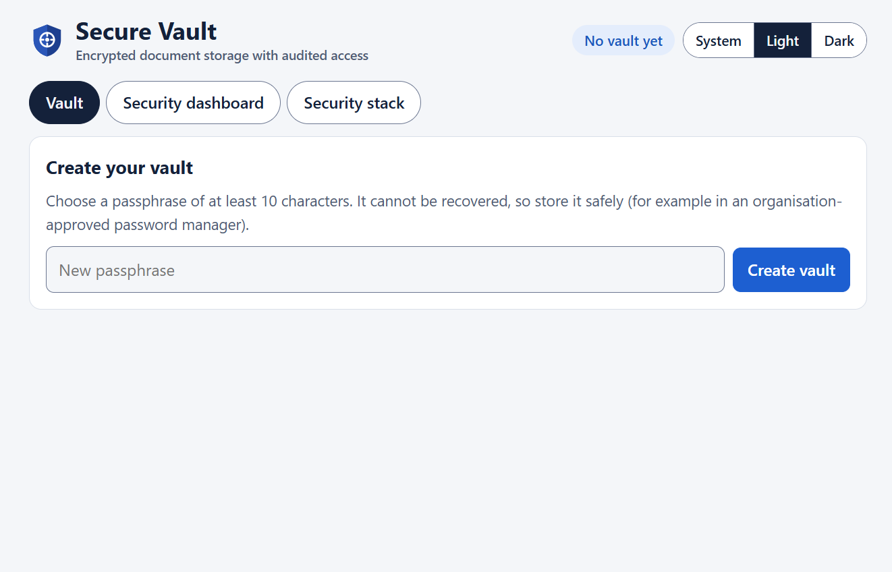
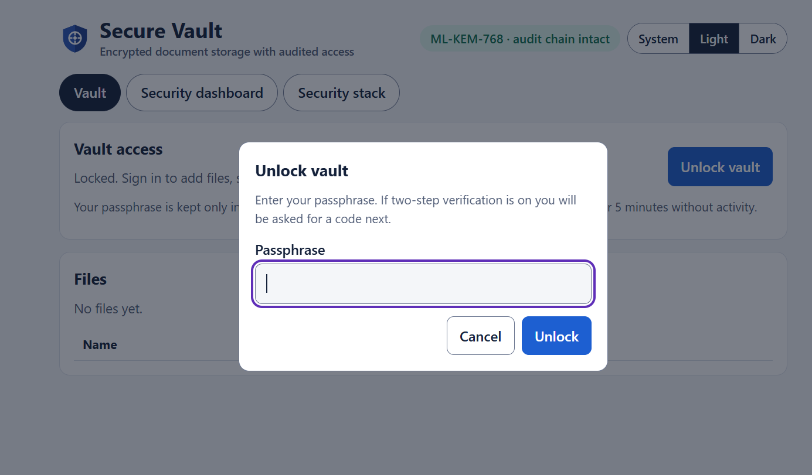
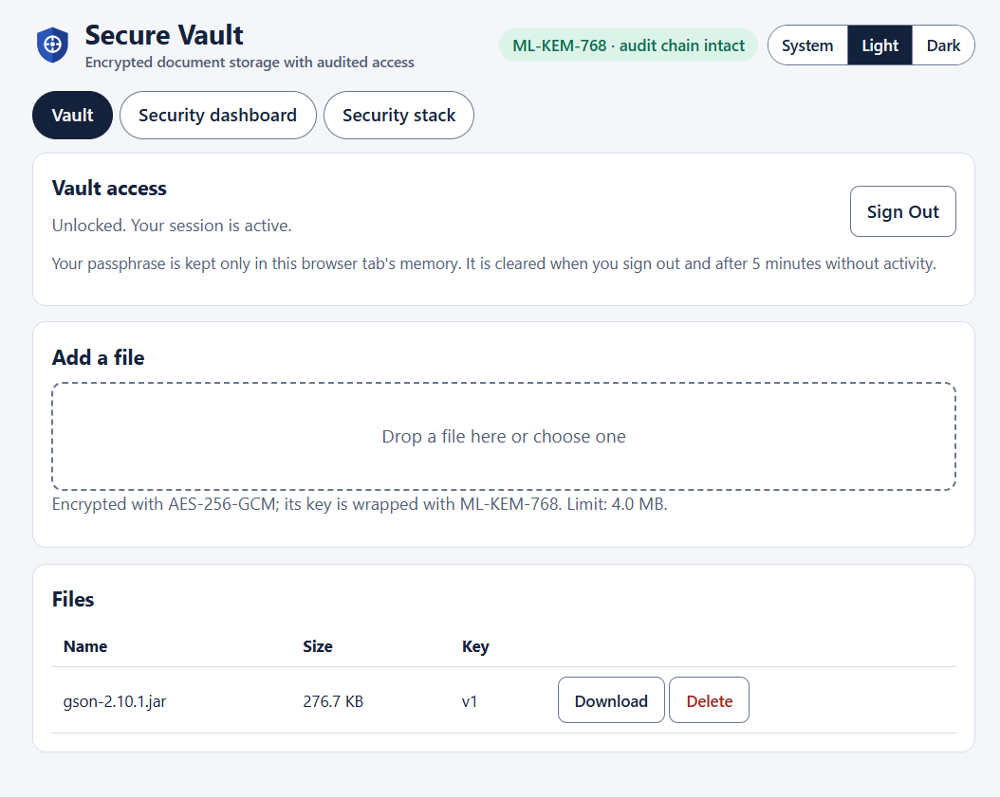
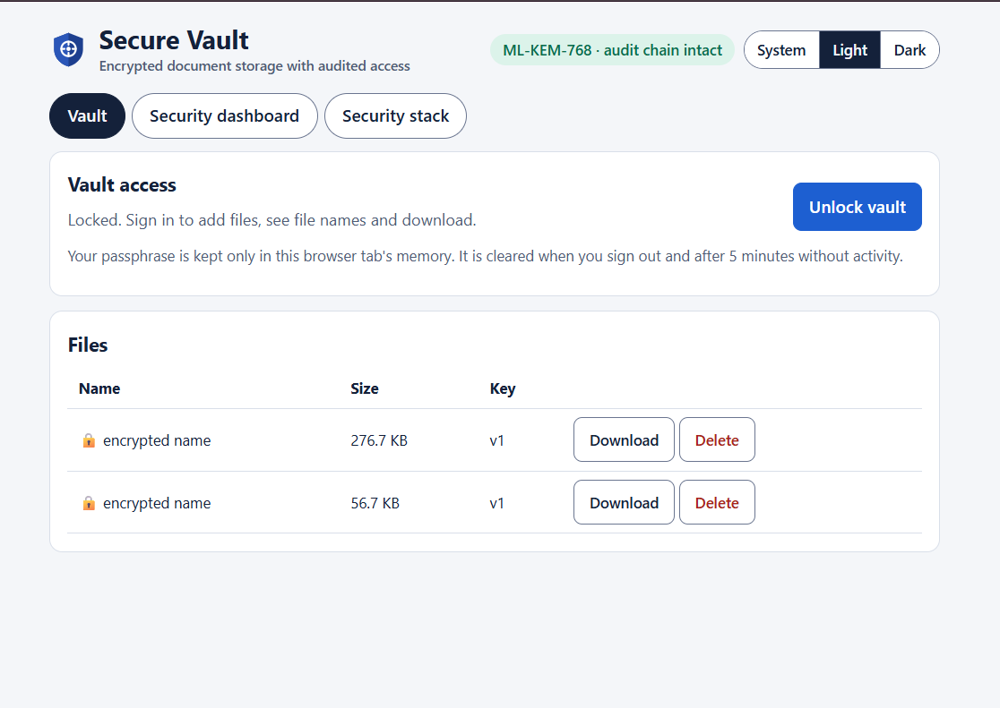
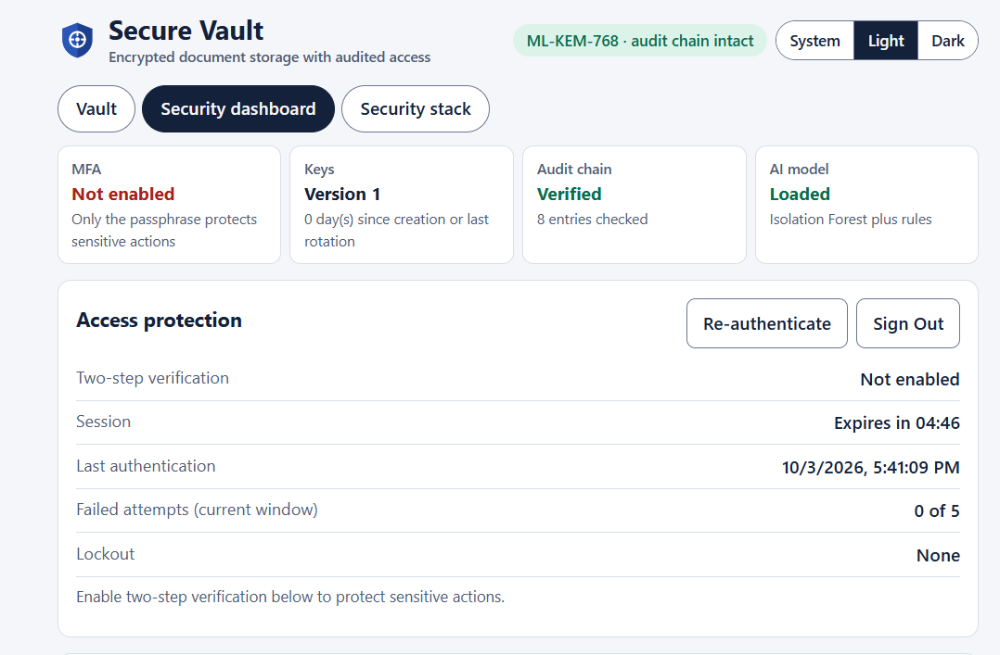
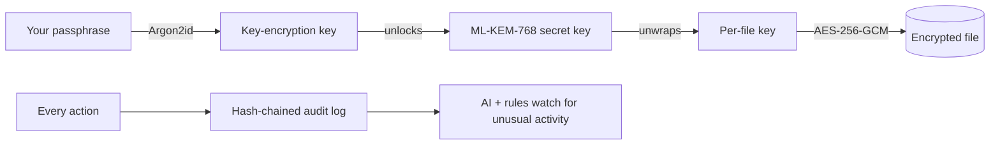

# Secure Vault

[](https://github.com/faiza861/secure-vault/actions/workflows/ci.yml)


A personal file vault that encrypts files with **AES-256-GCM**, protects every file key with the
**post-quantum ML-KEM-768** algorithm, records every action in a **tamper-evident hash-chained audit log**,
and watches access patterns with an **Isolation Forest AI model** plus fixed rules.

Information Security midterm project. Python 3.11+, free and open source end to end.

## In plain English

Imagine a digital safe for your files. You choose a passphrase, drop files in, and they are scrambled so that only
the passphrase can unscramble them. The safe also keeps a diary of everything that happens (uploads, downloads,
wrong passwords), written so that nobody can quietly edit or delete an entry without it showing. A small AI
watches that diary and raises an alert when activity looks unusual, for example hundreds of requests in a few
minutes. Extra protections stop people from guessing your passphrase and let you add a second step (a code from an
authenticator app) before sensitive actions.

> This is a learning and portfolio project. It is built with real, standard techniques, but it has **not** been
> independently audited or certified. See [Limitations](#limitations) before trusting it with anything critical.

<!-- Live demo: add your deployed link here, for example: **[Open the live demo](https://your-app.vercel.app)** -->

## Try it: choose your way

| You are... | Do this | Result |
| --- | --- | --- |
| **Just looking** | Read this page and the screenshots/demo video if present | Understand what it does in 2 minutes |
| **Non-technical, want to try it** | Install [Python](https://www.python.org/downloads/) (tick "Add python.exe to PATH"), then **double-click `Start-SecureVault.bat`** (Windows) or run `sh start.sh` (macOS/Linux) | The app opens in your browser. Files stay on your own computer. |
| **Developer** | Follow [manual setup](#for-developers-manual-setup-windows-powershell) below, run the tests, read `docs/` | Full control, CLI, tests |

The first start downloads the libraries (1 to 3 minutes, needs internet). After that it starts in seconds.
The launcher (`start.py`) only listens on your own computer, creates a private `.venv` folder, writes a local
`.env` settings file with a random secret, and never changes the app's code or your stored files.

The public live demo (Vercel + Neon free tier) is limited to small files because those free platforms cap request
sizes. For anything you care about, run it locally. Do not put real secrets in a shared demo.

## Screenshots

**1. Create a vault.** Choose a passphrase of at least 10 characters. It cannot be recovered.



**2. Unlock.** A dialog asks for the passphrase (and a 6-digit code if two-step verification is on).



**3. Use the vault.** Add files, see their names, download or delete them. Every file is encrypted with its own key.



**4. Locked view.** While locked, file names stay hidden ("encrypted name"), so even the file list reveals nothing.



**5. Access protection.** Live status of two-step verification, the session timer, failed attempts and lockout, next to
key version, audit-chain check and AI model status.



## How it works (one picture)



* **Passphrase to key:** Argon2id makes guessing slow and expensive.
* **Each file has its own key,** locked with a post-quantum algorithm (ML-KEM-768), so one leaked key exposes one file.
* **The audit log is a chain:** each entry contains a fingerprint of the one before it, so editing history breaks the chain.
* **Access protection:** after 5 wrong attempts the app pauses further tries; optional TOTP codes protect sensitive
  actions; short-lived sessions expire on their own.

### Words you may not know

| Term | Meaning |
| --- | --- |
| Encryption (AES-256-GCM) | Scrambles data so only the right key can read it, and detects tampering |
| Post-quantum (ML-KEM) | Key protection designed to resist future quantum computers |
| Hash chain | A log where each entry fingerprints the previous one, so changes show |
| TOTP / MFA | A 6-digit code from an authenticator app that changes every 30 seconds |
| Lockout | A temporary pause after too many wrong attempts, to stop guessing |

| Role | Technique |
| --- | --- |
| Classical crypto | Argon2id (passphrase KDF), AES-256-GCM (files), HKDF-SHA256, SHA-256 / HMAC |
| Post-quantum | ML-KEM-768 (NIST FIPS 203, formerly Kyber) wraps each file key |
| AI | Isolation Forest anomaly detector, trained with scikit-learn, served in pure Python |
| Audit | SHA-256 hash chain, with an anchor to catch truncation |

See `docs/ARCHITECTURE.md`, `docs/THREAT_MODEL.md` and `docs/EVALUATION.md`.

## For developers: manual setup (Windows PowerShell)

```powershell
python -m venv .venv
.\.venv\Scripts\Activate.ps1
pip install -r requirements-dev.txt
pip install -e .
pytest
```

### Command line (fully local)

```powershell
securevault init                       # create a vault (asks for a passphrase)
securevault upload .\report.pdf
securevault list
securevault download <file-id> -o .\out
securevault rotate-keys                # new ML-KEM key pair, files not re-encrypted
securevault rotate-passphrase
securevault audit                      # recent activity + chain status
securevault verify --anchor <head-hash>
securevault scan                       # AI + rule anomaly scan
securevault mfa status                 # is the authenticator (TOTP) protection on?
securevault mfa disable                # passphrase-only recovery if the authenticator is lost
```

Data lives in `data/vault/` (git-ignored). `python -m securevault --help` also works.

### Web app

```powershell
uvicorn securevault.api.main:app --reload --app-dir src
```

Open <http://127.0.0.1:8000>. Tabs: **Vault** (upload, list, download), **Security dashboard** (audit chain,
AI alerts, key rotation) and **Security stack** (which classical, post-quantum and AI techniques are used).
Interactive API docs are at `/docs`.

> **Hosted mode is not zero-knowledge.** The server does the decryption, so it briefly handles your passphrase
> and files. Use HTTPS. The CLI never sends anything anywhere.

### Access protection (lockout, MFA, sessions)

* **Lockout:** 5 failed unlocks or codes from one client in 5 minutes lock further attempts for 60 s, then 300 s,
  up to 15 minutes. The limit is recomputed from the audit log, so it needs no extra service.
* **Enable MFA:** unlock in the web app, open **Security dashboard -> Access Protection -> Enable MFA**, scan the
  QR code (or type the key) into an authenticator app, enter the 6-digit code. Then download, delete, key rotation,
  passphrase change and scan ask for a code, or reuse a recent MFA-verified sign-in. Each code works once.
* **Lost your authenticator?** Run `securevault mfa disable` on the machine that holds the vault (passphrase only).
* **Theme:** the header toggle switches System / Light / Dark.
* TOTP is not phishing-resistant, and MFA protects the online path, not a stolen disk. See `docs/THREAT_MODEL.md`.

New settings (all optional, see `.env.example`): `RATE_LIMIT_MAX_FAILURES`, `RATE_LIMIT_WINDOW_SECONDS`,
`LOCKOUT_SECONDS`, `RATE_LIMIT_GLOBAL_MAX_FAILURES`, `LOCKOUT_MAX_SECONDS`, `SESSION_SECRET`, `SESSION_TTL_SECONDS`,
`SESSION_IDLE_SECONDS`, `REAUTH_WINDOW_SECONDS`. Set `SESSION_SECRET` to a long random value in hosted deployments.

### Train and evaluate the AI model

```powershell
python -m securevault.monitor.train          # writes models/anomaly_model.json (+ .sha256)
python scripts/evaluate_detector.py
```

A trained model is already included in `models/`. Without one, the monitor falls back to rules only.

### Lab demos

```powershell
python demos\legacy_ciphers.py    # Caesar and Vigenere, and how they are broken
python demos\ecb_vs_gcm.py        # why the cipher mode matters
python demos\weak_hash_md5.py     # MD5 vs SHA-256 vs Argon2id
python demos\rsa_vs_mlkem.py      # RSA vs ML-KEM: sizes, speed, quantum threat
```

## Running a shared public demo

A public demo is one vault that every visitor shares. To stop a curious visitor from locking everyone out (by
changing the passphrase or switching on two-step verification), set these in Vercel under **Environment Variables**:

| Name | Value | Why |
| --- | --- | --- |
| `DEMO_MODE` | `true` | Turns off passphrase change and two-step verification setup; shows a notice on the page |
| `MAX_UPLOAD_BYTES` | `1048576` | Limits each upload to 1 MB so the free database does not fill up |

Visitors can still add, list, download and delete files, rotate keys, run the security scan and view the audit chain.
`DEMO_MODE` is off by default and changes nothing on a normal install. If someone makes a mess, empty the demo in Neon's
SQL Editor with `TRUNCATE sv_files, sv_keystore, sv_audit;` and create the vault again.

## Deploy for free (GitHub + Vercel + Neon)

1. Push this repo to GitHub (private is fine).
2. Create a free Postgres database at neon.com and copy its connection string.
3. Import the repo in Vercel (Hobby plan). Set environment variables:
   `STORAGE_BACKEND=postgres`, `DATABASE_URL=<neon string>`, and optionally `TZ_OFFSET_HOURS`.
4. Deploy. `api/index.py` exposes the FastAPI app; `vercel.json` includes the `web/`, `models/` and `src/` folders.

The Vercel deployment config could not be tested from the development environment, so treat the first deploy as
something to verify (check the function logs if the page does not load).

## Project layout

```text
src/securevault/  core/ audit/ monitor/ security/ storage/ api/ cli/ utils/ config.py
web/              index.html app.js theme.js style.css logo.svg
models/           trained anomaly model + checksum
scripts/          generate_logs.py evaluate_detector.py
demos/            lab demonstrations
tests/            unit/ integration/
docs/             architecture, threat model, evaluation
```

## Limitations

Pure-Python ML-KEM (not side-channel hardened), AI trained on simulated logs, best-effort lockout across serverless
instances, TOTP MFA that is not phishing-resistant, a single passphrase for everything. The full list is in `docs/THREAT_MODEL.md`.
